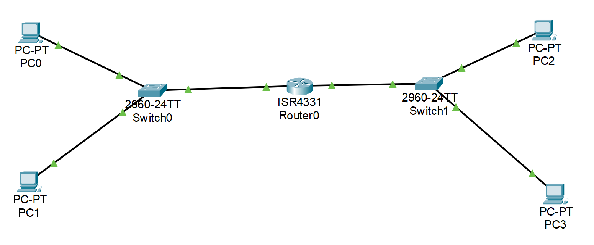
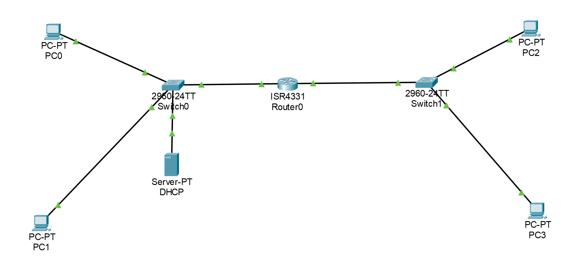

# 💼 Portfolio Informatique – Systèmes, Réseaux & Cybersécurité

Bienvenue sur mon portfolio technique.  
Ce dépôt regroupe mes projets pratiques en **administration systèmes et réseaux** ainsi que mes **labs en cybersécurité**.  
Chaque projet est documenté dans son propre dossier avec :  
- Les fichiers de configuration (Packet Tracer, configurations serveurs, etc.)  
- Des captures d’écran ou schémas  
- Un fichier `README.md` détaillant les objectifs, étapes et résultats  

---

## 📁 Structure du dépôt

### 🔹 Administration Systèmes & Réseaux
- [**Active Directory – Rue25**](./Administration/Active_Directory/Rue25)  
  - Installation et configuration de Windows Server 2019 (DHCP, ADDS, utilisateurs, groupes, dossiers partagés)  
  - 📷 Captures d’écran disponibles dans le dossier [Screenshots](./Administration/Active_Directory/Rue25/Screenshots)  
- [**GLPI – Rue25**](./Administration/GLPI)  
  - Installation et configuration de GLPI sur Debian 11.6  
  - 📦 La VM Debian avec GLPI installé est disponible en téléchargement (lien dans le README du projet)  

### 🔹 Réseaux
- [**Connexion LAN**](./Réseaux/Connexion_LAN)  
  - Configuration d’un LAN simple avec Packet Tracer et analyse des menaces courantes  
  - Topologie : [Topologie_LAN.pkt](./Réseaux/Connexion_LAN/Topologie_LAN.pkt) |   
- [**Serveur DHCP**](./Réseaux/Serveur_DHCP)  
  - Mise en place d’un serveur DHCP avec IP Helper et pools d’adressage  
  - Topologie : [Topologie_DHCP.pkt](./Réseaux/Serveur_DHCP/Topologie_DHCP.pkt) |   
- [**Menaces Réseau**](./Réseaux/Menaces_Réseaux.md)  
  - Étude et documentation des attaques Ping of Death & SYN Flood  

### 🔹 Scripts
- [**Analyse de Logs**](./Scripts/Analyse_Logs)  
  - Scripts pour analyser et traiter des journaux système et réseau  
- [**Automatisation**](./Scripts/Automatisation)  
  - Scripts d’automatisation *(à venir)*  

---

## 🔧 Compétences mises en œuvre
- **Réseaux** : Cisco Packet Tracer, DHCP, routage, LAN/WAN  
- **Systèmes** : Windows Server 2019/2022, Debian/Ubuntu  
- **Cybersécurité** : analyse de menaces, durcissement réseau, bases SOC (détection & réponse)  
- **Outils** : VirtualBox, GLPI, Wireshark, SIEM (Splunk, Chronicle)  
- **Langages / Scripts** : Python, SQL, Bash  

---

## 🚀 Objectif
Ce portfolio a pour but de démontrer mes compétences pratiques dans des **scénarios proches du monde professionnel** :  
- Mise en place et sécurisation d’infrastructures réseau  
- Administration systèmes Windows & Linux  
- Détection et documentation de menaces courantes  
- Production de documentation technique claire et exploitable  

---

## 📬 Contact
📧 Email : charbelelias@hotmail.fr  
🔗 LinkedIn : [Elias Charbel](https://www.linkedin.com/in/eliascharbel1/)

